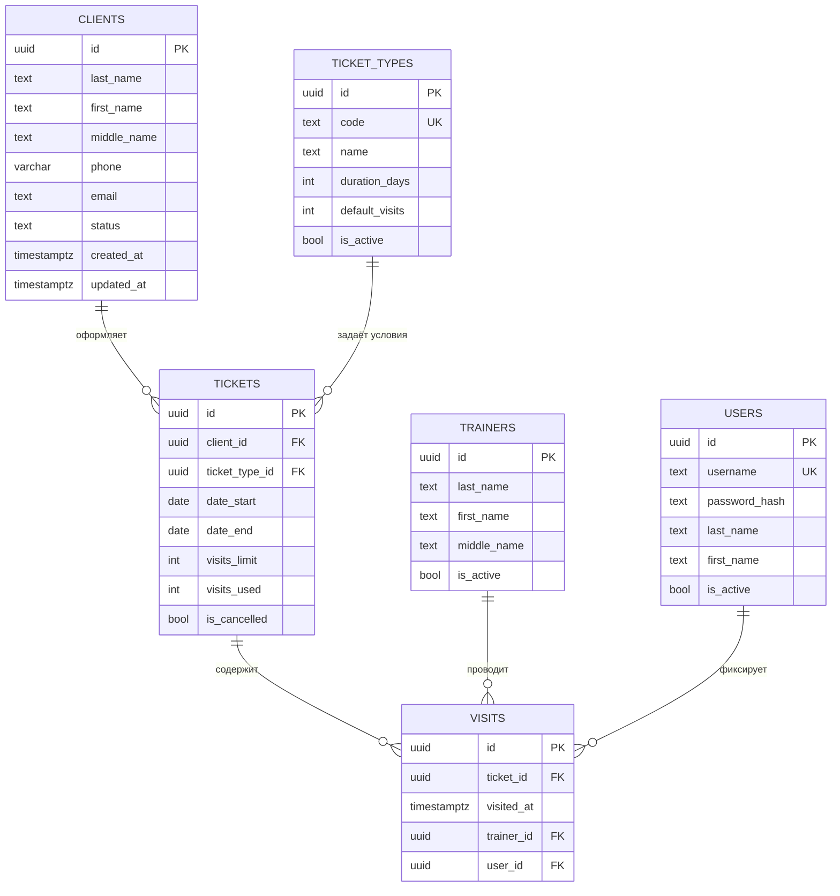
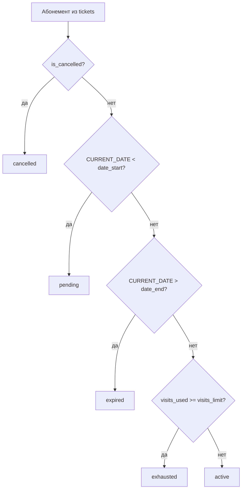
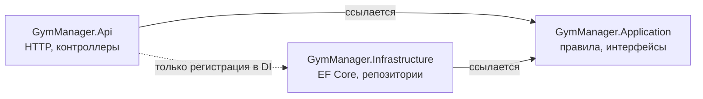
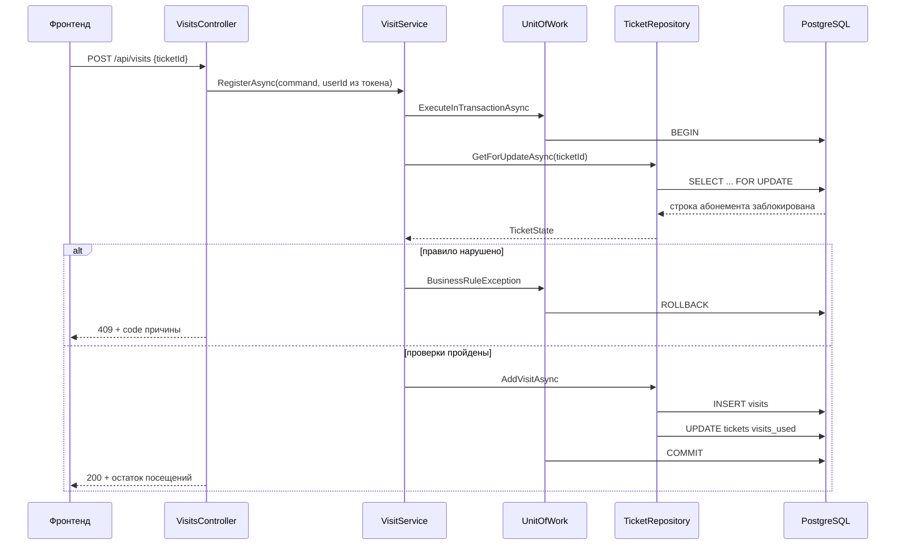
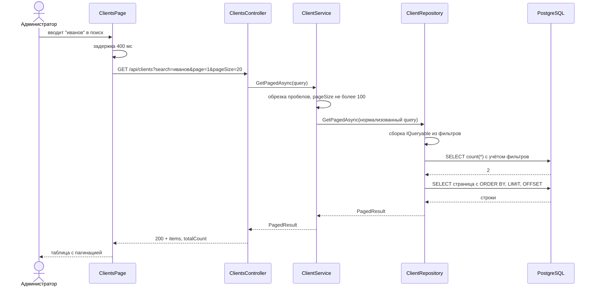
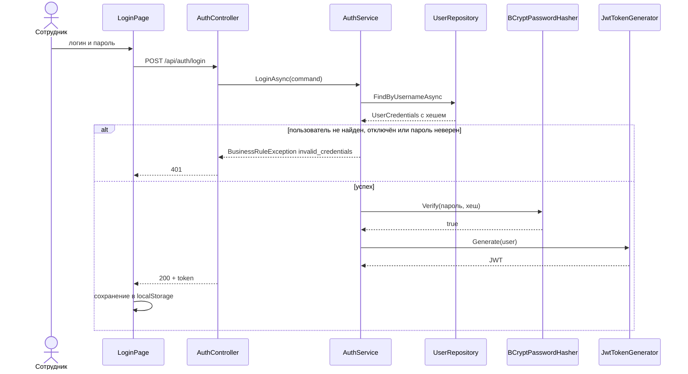
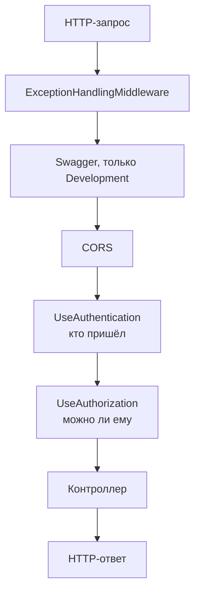
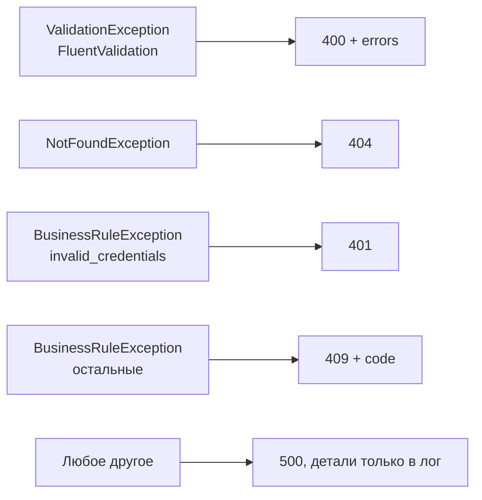

# Диаграммы GymManager

Диаграммы описаны на mermaid — GitHub и GitLab рендерят их прямо в вебе,
а исходник остаётся текстовым и правится вместе с кодом.

---

## 1. Модель данных

Шесть таблиц. Обрати внимание на два решения:

- у `TICKETS` **нет колонки status** — он вычисляется представлением
  `v_tickets`, потому что зависит от текущей даты;
- `VISITS` связана с клиентом только через `TICKETS`, прямой ссылки нет —
  иначе возможен рассинхрон, когда посещение указывает на одного клиента,
  а абонемент принадлежит другому.

### Представление v_tickets

Статус — не свойство записи, а функция от записи и текущего момента.
Хранимое поле неизбежно устаревает: абонемент истекает в полночь,
но операции записи при этом не происходит.

Порядок проверок задаёт приоритет причин: отменённый абонемент остаётся
отменённым, даже если у него ещё и срок вышел.

---

## 2. Архитектура слоёв

Обе сплошные стрелки сходятся в `Application`, и она не зависит ни от кого.
Интерфейсы репозиториев объявлены в ней, а реализованы в `Infrastructure` —
интерфейс принадлежит тому, кто им пользуется, а не тому, кто его реализует.

Пунктирная связь — единственное исключение: `Program.cs` знает обе стороны,
чтобы их соединить. Это место называют Composition Root.

---

## 3. Фиксация посещения

Самая сложная операция: две записи в одной транзакции, проверка правил
между ними и защита от гонки.

**Почему FOR UPDATE.** Без блокировки два одновременных запроса по абонементу
с одним оставшимся посещением оба прошли бы проверку и списали два:

| Шаг | Запрос A | Запрос B |
|---|---|---|
| 1 | читает: использовано 7 из 8 | |
| 2 | | читает: использовано 7 из 8 |
| 3 | проверка пройдена | проверка пройдена |
| 4 | пишет 8 | |
| 5 | | пишет 8 |

Блокировка превращает шаг 2 в ожидание: запрос B прочитает уже 8
и честно откажет.

Последний рубеж — `CHECK (visits_used <= visits_limit)` на уровне БД.

---

## 4. Список клиентов с поиском

Два обращения к базе вместо одного: общее количество считается **до**
`LIMIT`, иначе нельзя показать «всего 50» при загруженных двадцати строках.

---

## 5. Вход и работа с токеном

Сообщение об ошибке одно на все случаи — иначе перебором можно было бы
выяснить, какие логины существуют.

При фиксации посещения `userId` берётся **из токена**, а не из тела запроса:
иначе любой мог бы записать посещение от чужого имени.

---

## 6. Конвейер обработки запроса

Порядок принципиален. Обработчик ошибок стоит первым, потому что ловит
исключения только из того, что идёт ниже. Аутентификация обязана
предшествовать авторизации: сначала выясняем, кто пришёл, потом решаем,
можно ли ему.

### Как исключения превращаются в коды ответов

Текст непредвиденной ошибки наружу не отдаётся: он может раскрыть имена
таблиц, фрагменты SQL или содержимое базы.
